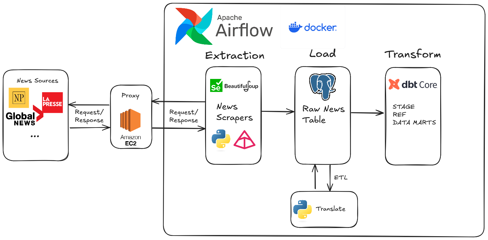
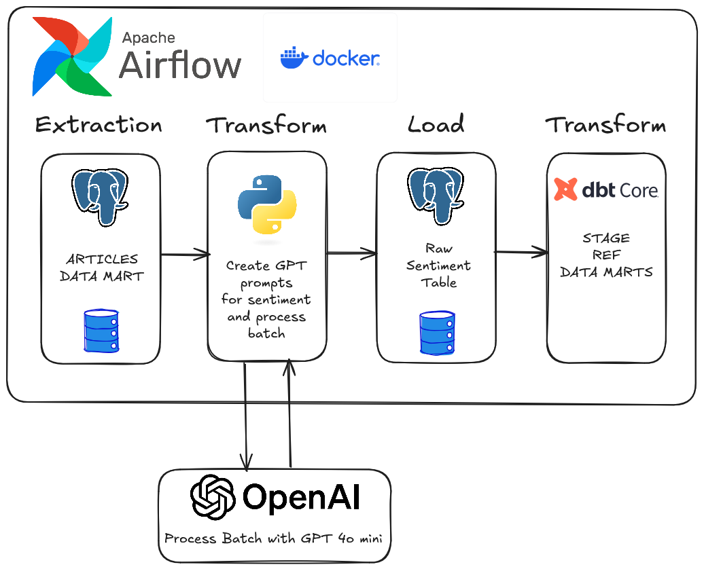
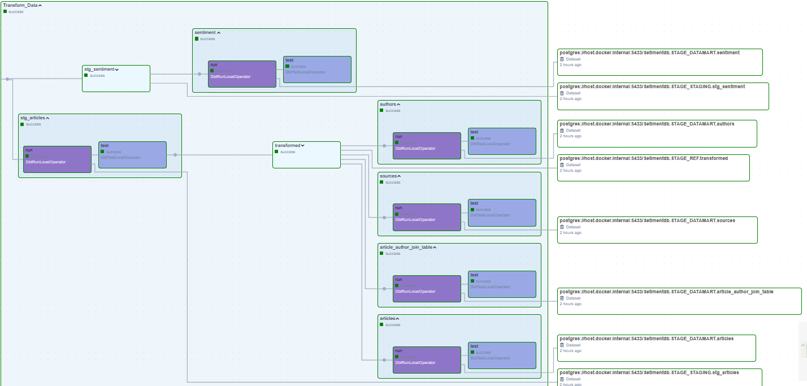
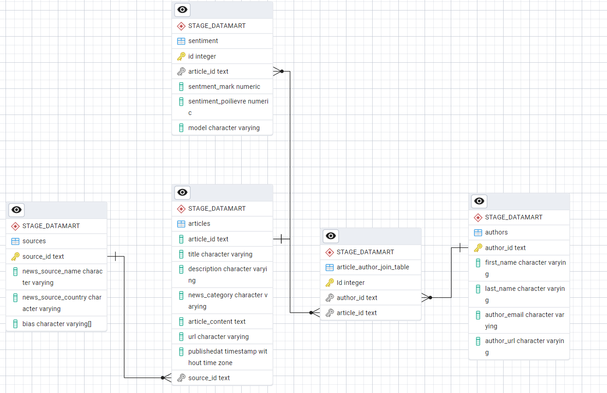
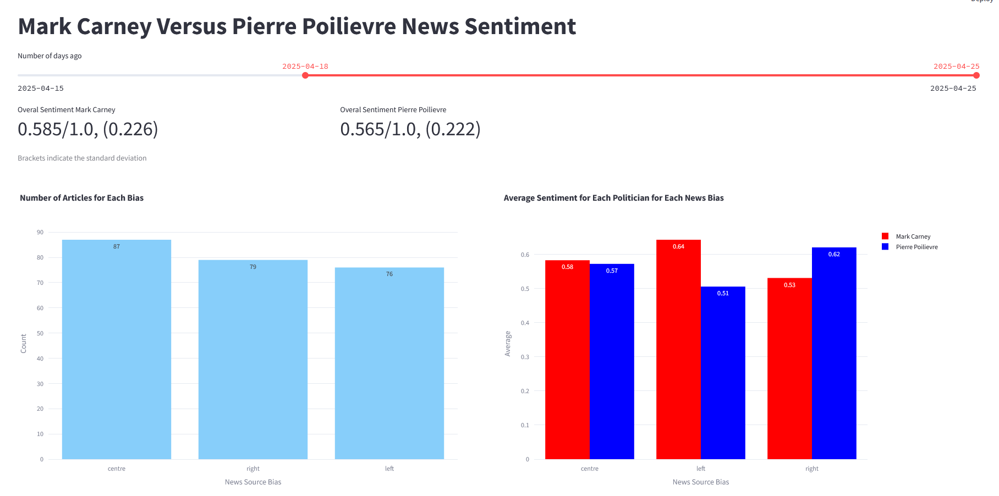
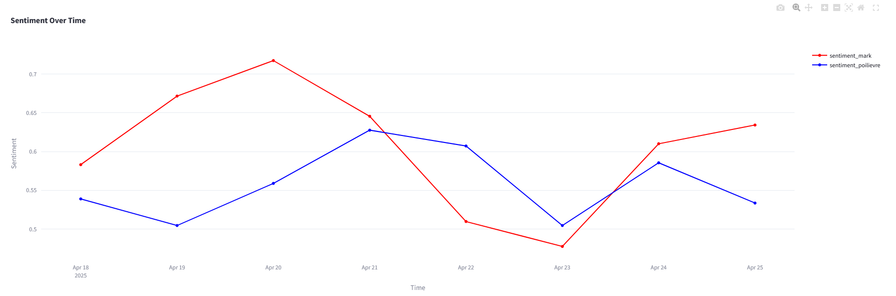

# Canadian News Data Pipeline

## Overview

News data pipeline for extracting canadian news, loading them to postgres and transforming appropriately.
The news scraping tries to use newspaper4k for majority of the weight lifting. A manual news scraper
was created to scrape what newspaper4k fails to scrape. After scraping, the news is loaded to a Postgres database and transformed with dbt core.

After, news that mention the two most prominent Canadian Prime Minister candidates: Mark Carney and Pierre Poilievre. With these articles
the OpenAI batch api is used to extract sentiment scores for each candidate if they are mentioned in the news article. These sentiment scores are
loaded to postgres and the Results are displayed using streamlit and Plotly. With this streamlit dashboard, each candidate's overal news sentiment scores
can be seen for the selected dates. Major Canadian news press were sampled while trying to keep political bias balanced to ensure non-biased results.

## Features

- Custom news scrapers for accurate, clean news extraction
- Uses ELT and ETL hybrid pipeline managed with Apache Airflow where ELT automates news extraction, ingestion into Postgres, dbt transformations, while french articles are extracted from postgres and translated to english, loaded back to Postgres, then dbt transformed (ETL)
- Streamlit dashboard for summarizing news sentiment for Mark Carney and Pierre Poilievre over time

## Architecture
- ### Data Ingestion


- ### Sentiment Analysis ETLT


## DBT models

### Data Model:


## Streamlit Dashboard
The dashboard pulls data from the data marts based on the date slider input. The left plot displays the bias of the sampled news outlets the right pplot displays the average sentiment for each bias.
News sources were selected with the goal of having an even split between left and right political views.

### Average Sentiment Over Time:


### Word Cloud:


## Tech Stack
- **Apache Airflow**: Scheduling of pipelines and automated web scraping
- **dbt core**: Transform raw tables into an analysis-ready data model
- **PostgreSQL**: Local data warehousing
- **Docker**: Containerization of the Airflow environment
- **Streamlit**: Interactive dashboard
- **OpenAI API**: Zero-shot sentiment analysis with gpt 4o mini 
- **Beautifulsoup and Selenium**: Enabled webscraping of both JavaScript and non-JavaScript websites
- **Pydantic**: Scraped/Extracted data validation

## Webscraping Methodology
- News was sampled from multiple news pages and RSS feeds while the news source selection was determined by news bias (based on https://mediabiasfactcheck.com) and prominence (https://www.bbc.com/news/world-us-canada-16841120).
- The news sites/RSS feeds that were scraped typically only have a fixed set of articles hence the need to use Airflow to schedule scraping every couple of hours in order to fully caputre the news.
- The scrapers that use newspaper4k first extract all article links in the RSS feed or specified news page. The set of links may be further filtered based on config to ensure the scraper is scraping news articles and not something else.
- Finally, each link is passed to either newspaper4k to get the article info or Selenium to retrieve HTML from JavaScript websites then the HTML is passed to newspaper4k to get the article info.
- Mechanisms were created to scrape the author information such as their email and profile URL in order to try to create a proper surrogate key in the authors table (Using only their name may cause problems as people can have the same name).
- The manual news scraper works in similar fashion but only uses Beautifulsoup to gather article info.

## Prerequisites
- Python 3.10+
- PostgreSQL database to store the data (Must be hosted on another port to avoid port conflict between PostgreSQL that Airflow will use within docker)
- Docker & Docker Compose
- OpenAI API key and credits

## Installation
- ### Step 1:
In your project folder, run the following in a terminal:
```# Clone the repository
git clone https://github.com/garettkaube/CanadianNewsDataPipeline.git
cd CanadianNewsDataPipeline

# Set up virtual environment
python -m venv venv
source venv/bin/activate

# Install dependencies
pip install -r requirements.txt
```

- ### Step 2:
Change directory to the CanadianNewsDataPipeline folder and create .env file and add:
- the POSTGRES_ADRESS environment variable as your postgres adress. E.g.: "postgresql://postgres:<password>@localhost:<port>/<database>"
- environment=local_dev
- ### Step 4:
Initialize the database tables by navigating to ./airflow_news/dags/news/init_db.py and running the python script
- ### Step 5:
Within ./airflow_news/news_dbt/, add the profiles.yaml :
```
news:
  outputs:
    dev:
      dbname: <Your_postgres_databse_name>
      host: host.docker.internal
      pass: <your_postgres_password>
      port: <your_postgres_port (can't be 5433)>
      schema: STAGE
      threads: 1
      type: postgres
      user: postgres
  target: dev
```
- ### Step 6:
Run ```docker-compose  -f airflow_news/docker-compose.yaml up -d``` in the terminal and wait for completion
- ### Step 7:
Run ```docker-compose -f airflow/docker-compose.yaml run airflow-worker airflow users create --role Admin --username <username> --email <email> --firstname <name> --lastname <name> --password <password>``` in the terminal and wait for completion. This will create the Airflow profile to log into the UI
- ### Step 8:
Open the Airflow UI at http://localhost:8080 and log into the account you just made
- ### Step 9:
In the Airflow UI, navigate to the connections page in the admin tab and add the Postgres connection and name it "postgres"
- ### Step 10:
In the Airflow UI, navigate to the variables page and add the variable "OpenAIKey" with value as your api key

**Note**: Proxy use is enabled by default, to disable, set "use_proxy": false in the scraper config json files 

Now the News_Ingestion pipleine should be able to be triggered and data should start flowing into the database.

## Airflow DAGS:
- News_Ingestion: scheduled every 3 hours to ELT news
- Sentiment_Analysis: scheduled at 5 pm UTC every day to analyze a batch of articles. The dag will wait 2 hours for the batch to complete
- load_sentiment: If the batch from Sentiment_Analysis took to long to process, this DAG can be ran manually to load the results


